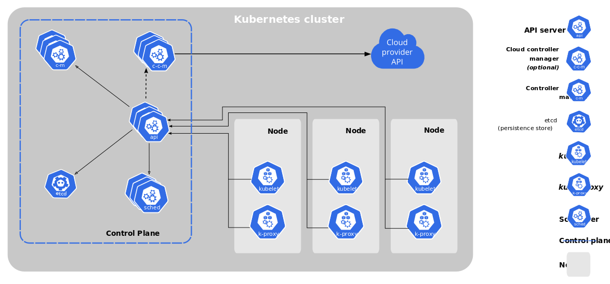

# 📘 Module 1: Introduction & Architecture

Welcome to Module 1! In this module, you'll gain a solid foundation in Kubernetes by exploring its key concepts, architecture, and how to set up your own cluster using `kubeadm`.

---

## 🧩 Kubernetes Introduction

**Kubernetes (K8s)** is an open-source platform that automates:

- 🔄 Deployment of containerized applications  
- ⚖️ Scaling to match demand  
- 🧭 Load balancing between containers  
- 🔁 Ongoing management and self-healing  

### 🔑 Key Features:
- 🚀 Automated deployment and scaling  
- 🌐 Service discovery & load balancing  
- ♻️ Self-healing (auto-restart, replace, reschedule containers)  
- 🔐 Secrets & configuration management  
- 🔄 Rolling updates & rollbacks  

# 🌐 What is Kubernetes?

**Kubernetes** (often abbreviated as **K8s**) is an **open-source platform** for automating the deployment, scaling, and management of containerized applications.

It was originally developed by **Google** and is now maintained by the **Cloud Native Computing Foundation (CNCF)**.

---

# 🧱 Why Kubernetes?

Before Kubernetes, managing applications running in **containers** (like Docker) was manual and error-prone.

Imagine deploying dozens (or hundreds) of containers — ensuring they run properly, are reachable, and can handle failures.

**Kubernetes automates these tasks**.

---

## 🏛️ Kubernetes Architecture

Kubernetes uses a **master-worker** architecture.

### 🧠 Master Node Components:
- **API Server**: Entry point to the control plane (receives and validates commands).  
- **Scheduler**: Assigns Pods to Nodes based on resources and policies.  
- **Controller Manager**: Maintains cluster state (e.g., node health, replication).  
- **etcd**: A consistent key-value store holding cluster data.

### ⚙️ Worker Node Components:
- **Kubelet**: Agent running on each node; communicates with API server.  
- **Kube-proxy**: Manages network rules and enables communication.  
- **Container Runtime**: Runs containers (e.g., Docker, containerd).


<!-- -->


---


## ⚙️ Kubernetes Cluster Setup Using Kubeadm

`kubeadm` helps bootstrap a secure Kubernetes cluster easily.

### 🚀 Steps to Set Up:
1. **Prepare Linux hosts** (e.g., Ubuntu 20.04).
2. **Install packages**:
   ```bash
   sudo apt install docker.io kubelet kubeadm kubectl
   ```
3. **Initialize the master node**:
   ```bash
   sudo kubeadm init --pod-network-cidr=192.168.0.0/16
   ```
4. **Configure kubectl for the current user**:
   ```bash
   mkdir -p $HOME/.kube
   sudo cp -i /etc/kubernetes/admin.conf $HOME/.kube/config
   sudo chown $(id -u):$(id -g) $HOME/.kube/config
   ```
5. **Deploy a Pod network add-on** (e.g., Calico or Flannel).
6. **Join worker nodes** using the token provided after init.

---

## 🗂️ Kubernetes Namespace

Namespaces provide **logical separation** in a single Kubernetes cluster.

### 🛠️ Why Use Namespaces?
- Isolate environments (dev, staging, prod)  
- Apply different access policies  
- Control resource usage via quotas

### 📁 Common Namespaces:
- `default`: For general-purpose workloads  
- `kube-system`: Kubernetes system components  
- `kube-public`: Public resources viewable by all

---

## 📦 Kubernetes Objects Overview

Kubernetes uses declarative **YAML/JSON objects** to manage cluster resources.

### 🧱 Core Objects:
- **Pod**: Smallest unit; holds one or more containers  
- **Service**: Stable network access to Pods  
- **Deployment**: Manages pod replicas and updates  
- **ConfigMap & Secret**: Store configuration and sensitive data  
- **PersistentVolume & PersistentVolumeClaim**: Handle persistent storage

---

> ✅ Great job! You're now familiar with how Kubernetes works under the hood and how to create your own cluster. Next up: core resources like Pods, Deployments, and Services!
